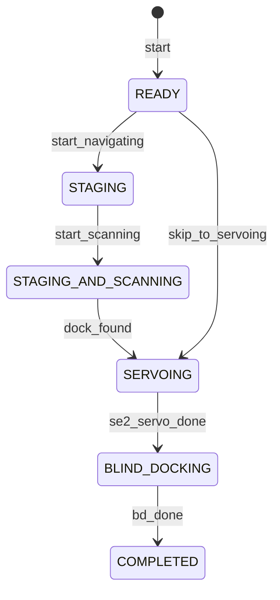
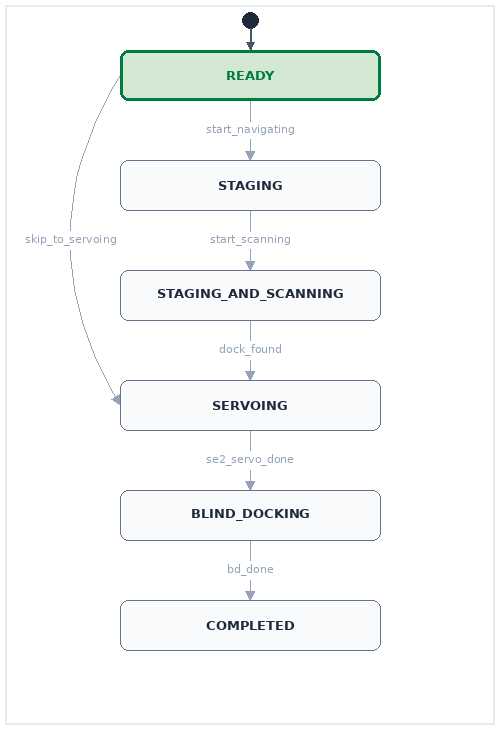
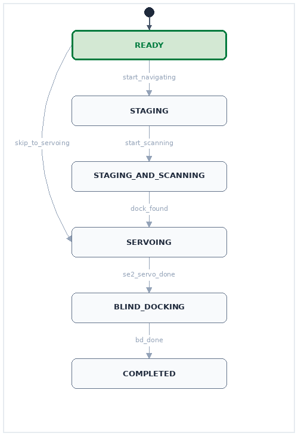

# Simple SM

A simple State Machine (SM) library in Python.

## How to

Install with:
```
pip install simple-sm
```

This example is based on the autodocking state machine in [Stretch's ROS2 SDK](https://github.com/hello-robot/stretch4_ros2):

```python
import time
from enum import Enum
from simple_sm import StateMachine, transition, step, MachineError

# 1. Define states as a standard Python Enum
class AutodockState(Enum):
    READY = 1
    STAGING = 2
    STAGING_AND_SCANNING = 3
    SERVOING = 4
    BLIND_DOCKING = 5
    COMPLETED = 6

# 2. Implement your action
class DockRobotAction:
    def __init__(self, do_work=0.0):
        self.do_work = do_work

        # 3. Initialize StateMachine, binding 'self' as the model
        self.machine = StateMachine(
            states=AutodockState,
            initial=AutodockState.READY,
            model=self
        )

    # 4. Decorate transitions w/
    #    - @transition(from, to)
    #    - @transition([from1, from2], to)
    #    - @transition('*', to)
    # If the wrapped method executes without error, self.machine.state updates

    @transition(source=AutodockState.READY, dest=AutodockState.STAGING)
    def start_navigating(self, goal: str):
        print(f"[Transition] Setting up navigation to: {goal}")

    @transition(source=AutodockState.READY, dest=AutodockState.SERVOING)
    def skip_to_servoing(self):
        print("[Transition] Skipping staging, resetting servo control.")

    @transition(source=AutodockState.STAGING, dest=AutodockState.STAGING_AND_SCANNING)
    def start_scanning(self):
        print("[Transition] Arrived near staging area, starting scan.")

    @transition(source=AutodockState.STAGING_AND_SCANNING, dest=AutodockState.SERVOING)
    def dock_found(self):
        print("[Transition] Dock detected! Starting servo control.")

    @transition(source=AutodockState.SERVOING, dest=AutodockState.BLIND_DOCKING)
    def se2_servo_done(self):
        print("[Transition] SE2 PID servo control done. Initiating blind docking.")

    @transition(source=AutodockState.BLIND_DOCKING, dest=AutodockState.COMPLETED)
    def bd_done(self):
        print("[Transition] Charging contacts established.")

    # 5. Decorate state stepping w/
    #    - @step(state)
    #    - @step('*')
    # --- Steps ---
    # These methods are called once per machine.step()
    # It is safe to call transitions from inside step functions.

    @step(AutodockState.STAGING)
    def step_staging(self):
        print("[Step] Navigating...")
        self.start_scanning()

    @step(AutodockState.STAGING_AND_SCANNING)
    def step_scanning(self):
        print("[Step] Scanning environment, looking for dock...")
        self.dock_found()

    @step(AutodockState.SERVOING)
    def step_servoing(self):
        print("[Step] Running PID loop to servo robot...")
        self.se2_servo_done()

    @step(AutodockState.BLIND_DOCKING)
    def step_blind_docking(self):
        print("[Step] Performing blind docking push...")
        self.bd_done()

    @step("*")
    def simulate_work(self):
        if self.do_work:
            print(f"[Catch-All Step] Simulating work in {self.machine.state.name}...")
            time.sleep(self.do_work)

    # 6. Write an execution loop
    def execute_docking(self, goal_pose: str, navigate: bool):
        print(f"\n--- Starting Autodock Sequence (navigate={navigate}) ---")
        print(f"Current State: {self.machine.state.name}")

        try:
            # Get the ball rolling
            self.start_navigating(goal_pose) if navigate else self.skip_to_servoing()
            print(f"Current State: {self.machine.state.name}")

            # Run the machine until completion
            while self.machine.state != AutodockState.COMPLETED:
                self.machine.step()
                print(f"Current State: {self.machine.state.name}")

            print("Successfully docked!")

        except MachineError as e:
            print(f"Transition Blocked: {e}")
        finally:
            # 7. Reset machine
            self.machine.set_state(AutodockState.READY)
            print(f"Reset to: {self.machine.state.name}")


if __name__ == "__main__":
    action = DockRobotAction()

    # Run with navigation
    action.execute_docking(goal_pose="kitchen_dock", navigate=True)

    # Run skipping navigation
    action.execute_docking(goal_pose="office_dock", navigate=False)
```

## Rendering to Mermaid (Natively rendered on GitHub)
Generate a text-based diagram of your state machine:
```python
mermaid_code = action.machine.to_mermaid()
print(mermaid_code)
```



## Rendering to Image(s)
Render the state machine to an image on disk or an IO buffer (active state is colored in red, last-fired transition in blue):
```python
io_buf = action.machine.draw("fsm_init.png", format='png')
```


## Realtime Execution

Simple SM works well embedded in long-running controller. By encoding the flow through states in the stepping methods, your control loop simply calls `machine.step()` repeatedly.

```python
action = DockRobotAction(do_work=1.0)

try:
    # Get the ball rolling
    action.start_navigating('kitchen_dock')

    # Run the machine until completion
    while action.machine.state != AutodockState.COMPLETED:
        action.machine.step()

    print("Successfully docked!")
finally:
    # Reset machine
    action.machine.set_state(AutodockState.READY)
    print(f"Reset to: {action.machine.state.name}")
```

## Multithreading & Live Preview

A nice pattern is to run your controller loop in one thread while a low-rate background thread handles diagnostics or live visualization.

Because Simple SM is thread-safe, a second visualization thread can safely query and render the state machine in realtime. I've profiled a single render to take <6ms, so you can likely preview up to 175 FPS.

```python
import threading
import time
import cv2
import numpy as np

def live_preview_worker(action: DockRobotAction):
    # Preview loop running at 25Hz (every 40ms)
    while action.machine.state != AutodockState.COMPLETED:
        # 1. Render the FSM using the Pillow renderer
        pil_img = action.machine.renderer.render()
        
        # 2. Convert PIL Image to OpenCV BGR format for GUI display
        cv_img = cv2.cvtColor(np.array(pil_img), cv2.COLOR_RGB2BGR)
        
        # 3. Display the image frame in an OpenCV GUI window
        cv2.imshow("Real-Time Monitor", cv_img)
        
        # 4. Wait 40ms (~25Hz) and handle window close events
        if cv2.waitKey(40) & 0xFF == ord('q'):
            break

    cv2.destroyAllWindows()

# Start the live monitor thread
preview_thread = threading.Thread(target=live_preview_worker, args=(action,), daemon=True)
preview_thread.start()
```




## Type Checking

Simple SM skips the dynamic magic and monkey-patching, so it plays nicely with IDE autocomplete and static type checkers like `mypy`.

```python
# 1. Type-hint the state machine with your specific Enum
sm: StateMachine[AutodockState] = action.machine

# 2. Get autocompleted and verified state queries
current_state: AutodockState = sm.state
print(current_state)  # AutodockState.READY

# 3. Static type checkers (like mypy) will instantly catch mismatched state objects:
class BatteryState(Enum):
    CHARGING = 1
    DISCHARGING = 2

# This is flagged as a type-checking error before you run it:
sm.set_state(BatteryState.CHARGING)
# mypy error: Argument 1 to "set_state" of "StateMachine" has incompatible type "BatteryState"; expected "Union[AutodockState, str]"
```

## Running Tests

```bash
PYTHONPATH="" uv run pytest
```

*clear `PYTHONPATH` during execution to run the tests in complete isolation*
